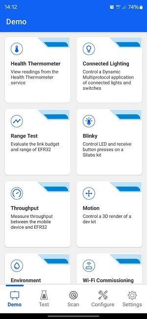
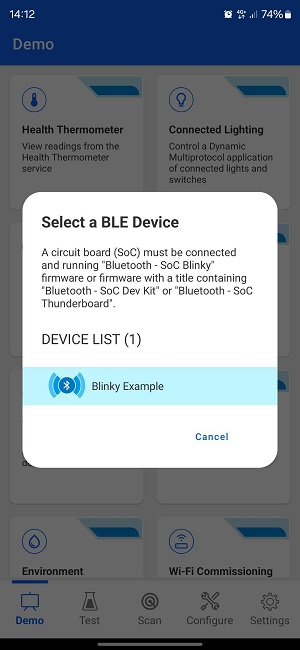
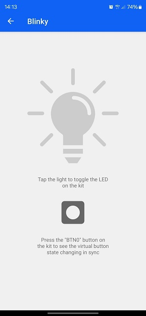
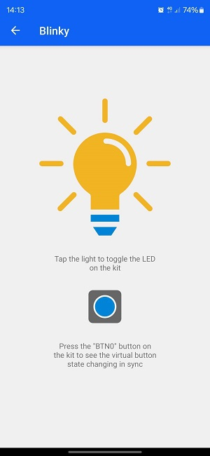
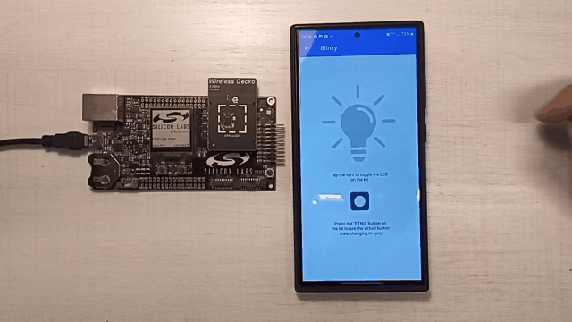

# SoC - Blinky

This example application is the "Hello World" of Bluetooth Low Energy (BLE). It allows a BLE central device to control the LED on the mainboard and receive button press notifications.

> Note: this example does not include Device Firmware Update (DFU) functionality by default. For details see the [Device Firmware Update](#device-firmware-update) section.

## Getting started

To get started with Silicon Labs Bluetooth and Simplicity Studio, see [QSG169: Bluetooth SDK v3.x Quick Start Guide](https://www.silabs.com/documents/public/quick-start-guides/qsg169-bluetooth-sdk-v3x-quick-start-guide.pdf).

This example implements a simple custom GATT service with two characteristics. One characteristic controls the state of the LED (ON/OFF) via write operations from a GATT client, and the second characteristic sends notifications to subscribed clients when the button state changes (pressed or released).

To test this demo, install Simplicity Connect for [Android](https://play.google.com/store/apps/details?id=com.siliconlabs.bledemo&hl=en&gl=US) or [iOS](https://apps.apple.com/us/app/simplicity-connect/id1030932759). Source code for the mobile app is available on Github for [Android](https://github.com/SiliconLabs/SimplicityConnect-android) and [iOS](https://github.com/SiliconLabs/SimplicityConnect-ios).

After launching the app go to the demo view and select the Blinky demo. A pop-up will show all the devices around you that are running the SoC-Blinky firmware. Tap on the device to go into the demo view.

 

Tap the light on the mobile app to toggle the LED on the mainboard. When you press/release the button on the mainboard the state changes for the virtual button on the app as well.

 

The animation below showcases the demo running on an EFR32xG21 Wireless Starter Kit with the mobile app running on an Android device.

## Device Firmware Update

This example project does not include Device Firmware Update (DFU) functionality by default, but it can be added easily.
SoC applications can use one of Silicon Labs' Over-the-Air (OTA) DFU implementations. The table below summarizes the options:

|                           | In-place OTA DFU                 | Application OTA DFU                 |
|---------------------------|----------------------------------|-------------------------------------|
| **Component to add**      | In-place OTA DFU                 | Application OTA DFU                 |
| **Compatible bootloader** | Bluetooth Apploader OTA DFU      | Bootloader - SoC Internal Storage (Series 2)   Bootloader - SoC Storage (Series 3) |
| **Reference solution**    | Bluetooth - SoC In-Place OTA DFU | Bluetooth - SoC Application OTA DFU |
| **Supported devices**     | Supports Series 2 devices only and requires a smaller flash size | Supports Series 2 and Series 3 devices with enough flash to store firmware images in 2 instances |

To add DFU to an existing project:
- Add the appropriate DFU component to your project using Simplicity Studio’s Software Component browser.
- Add a post-build step to generate the GBL (Gecko Bootloader) file using Simplicity Studio’s Post Build Editor.
- Rebuild the project.
- Flash a compatible bootloader to the device.

For more information on bootloaders, see [UG103.6: Bootloader Fundamentals](https://www.silabs.com/documents/public/user-guides/ug103-06-fundamentals-bootloading.pdf) and [UG489: Silicon Labs Gecko Bootloader User's Guide for GSDK 4.0 and Higher](https://www.silabs.com/documents/public/user-guides/ug489-gecko-bootloader-user-guide-gsdk-4.pdf).

## Troubleshooting

### Programming the Radio Board

Before programming the radio board mounted on the mainboard, make sure the power supply switch is in the AEM position (right side) as shown below.

## Resources

[Bluetooth Documentation](https://docs.silabs.com/bluetooth/latest/)

[UG103.14: Bluetooth LE Fundamentals](https://www.silabs.com/documents/public/user-guides/ug103-14-fundamentals-ble.pdf)

[QSG169: Bluetooth SDK v3.x Quick Start Guide](https://www.silabs.com/documents/public/quick-start-guides/qsg169-bluetooth-sdk-v3x-quick-start-guide.pdf)

[UG434: Silicon Labs Bluetooth ® C Application Developer's Guide for SDK v3.x](https://www.silabs.com/documents/public/user-guides/ug434-bluetooth-c-soc-dev-guide-sdk-v3x.pdf)

[Bluetooth Training](https://www.silabs.com/support/training/bluetooth)

## Report Bugs & Get Support

You are always encouraged and welcome to report any issues you found to us via [Silicon Labs Community](https://www.silabs.com/community).
